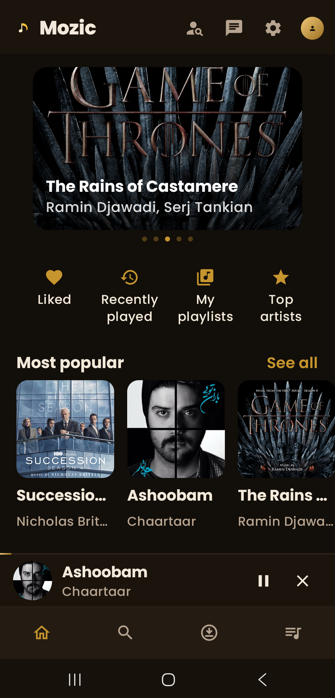
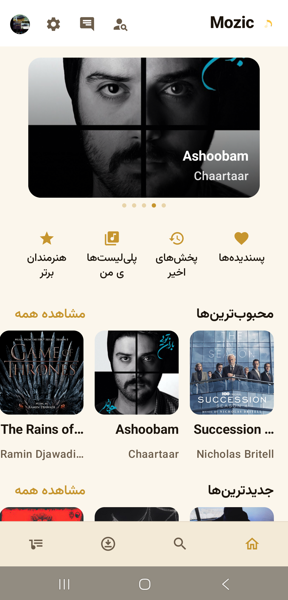
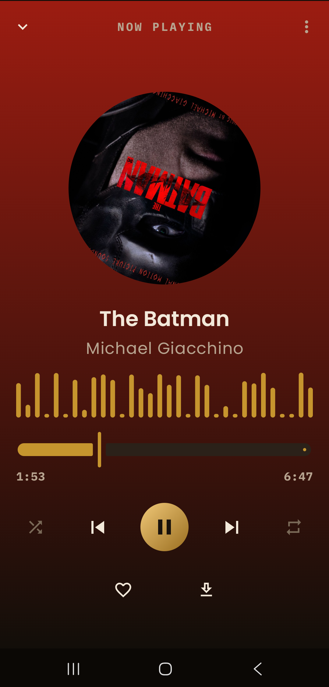
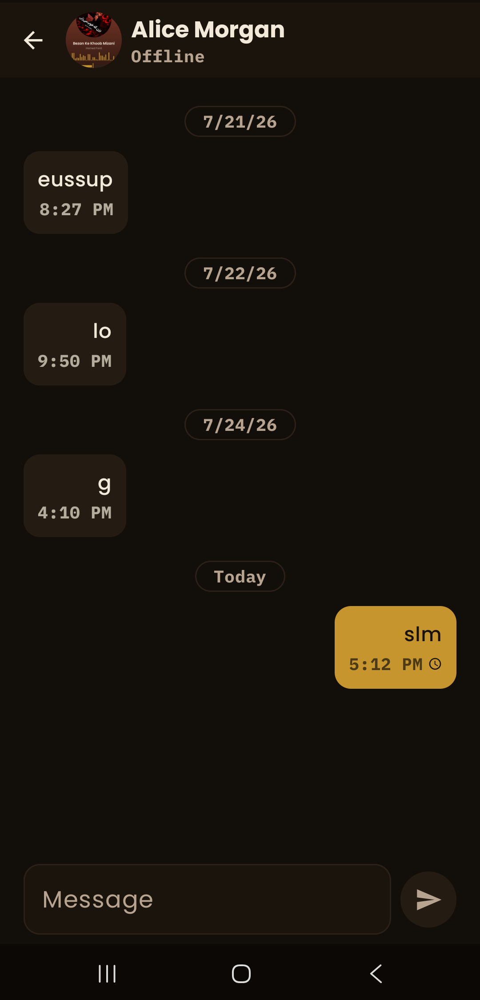

#  Mozic

> A modern music streaming, real-time social networking, and chat application built with **Kotlin**, **Jetpack Compose**, and **Multi-Module Clean Architecture**.


---

## 📋 Table of Contents

- [👥 Team Members](#-team-members)
- [📖 About The Project](#-about-the-project)
- [✨ Key Features](#-key-features)
- [🖼️ Application Screenshots](#️-application-screenshots)
- [🛠️ Architecture & Technology Stack](#️-architecture--technology-stack)
- [📁 Repository Structure](#-repository-structure)
- [🚀 Getting Started (Local Setup)](#-getting-started-local-setup)
- [🧪 Testing & Quality Assurance](#-testing--quality-assurance)
- [🔑 Demo Accounts](#-demo-accounts)
- [📜 Documentation & Contracts](#-documentation--contracts)
- [📝 License](#-license)

---

## 👥 Team Members

- **[Bardia Sabbagh](https://github.com/bardia1122)**
- **[Roza GanjiPoor](https://github.com/Rozagp)**
- **[SeyedAli Mohammad Dastan](https://github.com/seyedalida)**

---

## 📖 About The Project

> *Developed as the final project for the **Mobile Programming** course at Amirkabir University of Technology.*

**Mozic** is a highly scalable, real-time music streaming and social networking platform engineered for Android. Built from the ground up using **Multi-Module Clean Architecture** principles, the platform decouples UI presentation from business logic and background data processing.

The app provides high-fidelity background audio streaming, offline library synchronization, and live social interaction—allowing users to follow friends, explore public playlists, and exchange messages with **interactive playable song-sharing cards** powered by a low-latency custom WebSocket protocol.

---

## ✨ Key Features

- 🎧 **Background Media Engine:** Continuous audio streaming with **Jetpack Media3 (ExoPlayer)**, integrated with `MediaSessionService`, lockscreen controls, and system notification media cards.
- 💬 **Real-Time WebSocket Messaging:** Custom bidirectional protocol supporting message delivery ACKs, read receipts (`✓` -> `✓✓`), and live typing indicators (`...is typing`).
- 🎵 **Interactive Song Share Cards:** Share tracks directly within chat threads; recipients can trigger immediate playback with a single tap.
- 💾 **Offline-First & Smart Play:** Automated local caching via **Room Database** and background track downloading with **WorkManager**. Intelligently switches to local audio files when available.
- 🎨 **Now Playing UX Polish:** Rotating album artwork synced to playback state, dynamic dominant color background extraction via the **Palette API**, and an interactive **Compose Canvas Audio Visualizer**.
- 🔍 **Debounced Catalog Search:** Instant, low-latency search across songs, artists, and playlists with search history persistence in Room.
- 🌍 **Full Localization & Theme Support:** Dual-language support (**English & Persian**) with dynamic live **RTL / LTR** layout mirroring and Material 3 Dark/Light themes.

---

## 🖼️ Application Screenshots

<p align="center">
  
  &nbsp;&nbsp;&nbsp;&nbsp;
  
</p>
<br/>
<p align="center">
  
  &nbsp;&nbsp;&nbsp;&nbsp;
  
</p>

---

## 🛠️ Architecture & Technology Stack

The application enforces strict separation of concerns across 15+ decoupled Gradle modules:

| Domain | Technology | Role |
| :--- | :--- | :--- |
| **Application Shell** | **Jetpack Compose**, **Navigation Compose** | Typed route navigation, BottomBar, TopBar & settings |
| **Media Playback Engine** | **Jetpack Media3 (ExoPlayer)**, **Palette API** | Foreground service audio engine, audio focus, visualizer |
| **Networking & API** | **Ktor Client 3.5**, **Kotlinx Serialization** | REST HTTP engine & WebSocket client |
| **Cloud Backend** | **Supabase** (PostgreSQL, PostgREST, Auth) | Cloud catalog storage, authentication & user profiles |
| **WebSocket Chat Server** | **Python FastAPI** / **Kotlin Ktor** | Dedicated Real-Time WebSocket server (`PROTOCOL.md`) |
| **Local Persistence** | **Room Database 2.8**, **DataStore** | Single source of truth for offline messages & preferences |
| **Background Tasks** | **WorkManager 2.11** | Resilient background track downloader |
| **Dependency Injection** | **Dagger Hilt 2.60** | Compile-time dependency injection across modules |
| **Pagination & Images** | **Paging 3**, **Coil 3** | Lazy list catalog loading & async image caching |

---

## 📁 Repository Structure

```text
Mozic/
├── app/                        # Application shell, NavHost, BottomBar & DI setup
├── core/
│   ├── common/                 # Shared coroutine dispatchers & base utilities
│   ├── data/                   # Offline-first repositories, Room DB & DataStore
│   ├── designsystem/           # Material 3 tokens, colors, typography & themes
│   ├── domain/                 # Core domain models, UseCases & repository contracts
│   ├── media/                  # ExoPlayer playback engine, MediaSessionService & notification
│   ├── network/                # Ktor HTTP client, DTOs, Supabase API & WebSocket client
│   └── ui/                     # Reusable UI components (shimmer skeletons, cards, dialogs)
├── feature/                    # Feature modules
│   ├── chat/                   # Conversation thread, messaging UI & song share cards
│   ├── downloads/              # WorkManager downloads & offline track management
│   ├── home/                   # Trending carousels, section lists & top artists
│   ├── library/                # Liked songs, recently played & user library
│   ├── player/                 # Full screen Now Playing, disc rotation & audio visualizer
│   ├── playlists/              # World, Local & User playlist grids
│   ├── profile/                # User profile, premium badge & avatar management
│   ├── search/                 # Debounced search screen with Room query history
│   ├── settings/               # Language (EN/FA), theme & account settings
│   └── social/                 # User search, follow graph & friends' public playlists
├── docs/
│   └── screenshots/            # Application UI screenshots
└── backend/                    # Backend services
    ├── python/                 # Python/FastAPI WebSocket chat server (recommended)
    ├── src/                    # Original Kotlin/Ktor WebSocket chat server
    └── supabase/               # SQL Schema, RLS policies & database seed scripts
```

---

## 🚀 Getting Started (Local Setup)

### Prerequisites
- **Android Studio** (Ladybug 2024.2+ or Android Studio Jellyfish/Koala)
- **JDK 17** or **JDK 21**
- **Python 3.9+** *(required for running the WebSocket chat server)*

---

### 1. Launch the WebSocket Chat Backend
Start the real-time WebSocket server for handling messaging, typing indicators, and read receipts:

```bash
cd backend/python
pip install -r requirements.txt
python main.py
```
> 🌐 The server runs on `http://localhost:8080`. Verify status:  
> `curl http://localhost:8080/health` → Output: `"ok"`

---

### 2. Launch the Android Client
1. Open the project root directory in **Android Studio**.
2. Allow **Gradle Sync** to finish indexing.
3. Select an Emulator (or connected physical Android device with Developer Options enabled).
4. Click **Run** (`Shift + F10`) or execute via Gradle CLI:
   ```bash
   ./gradlew installDebug
   ```

---

## 🧪 Testing & Quality Assurance

The codebase includes static analysis and code formatting rules to maintain high quality:

- **Run Static Analysis (Detekt):**
  ```bash
  ./gradlew detekt
  ```
- **Check Kotlin Code Style (Ktlint):**
  ```bash
  ./gradlew ktlintCheck
  ```
- **Run Unit Tests:**
  ```bash
  ./gradlew test
  ```

---

## 🔑 Demo Accounts

Use any of the pre-seeded demo accounts below to sign in (**Password for all accounts:** `password123`):

| Email | Username | Subscription | Initial Seeded Data |
| :--- | :--- | :--- | :--- |
| `alice@mozic.dev` | `alice` | Premium | Active chats with Bob & Sara (Song share cards) |
| `bob@mozic.dev` | `bob` | Free | Active conversation thread with Alice |
| `sara_m@mozic.dev` | `sara_m` | Premium | Follow graph & public playlists |
| `arman_k@mozic.dev` | `arman_k` | Free | Sample catalog listener profile |
| `lily_c@mozic.dev` | `lily_c` | Free | Sample catalog listener profile |
| `dj_reza@mozic.dev` | `dj_reza` | Premium | Sample artist profile |

---

## 📜 Documentation & Contracts

Additional technical specifications and wire protocols are documented within the repository:
- 📄 [PROTOCOL.md](file:///home/seyedalida/Desktop/uni/8/mobile/pr/Mozic/backend/PROTOCOL.md): WebSocket wire format, message frame definitions, and auth handshake details.
- 📄 [backend/README.md](file:///home/seyedalida/Desktop/uni/8/mobile/pr/Mozic/backend/README.md): Supabase REST integration, endpoints, and Python/Kotlin backend setup.
- 🗄️ [schema.sql](file:///home/seyedalida/Desktop/uni/8/mobile/pr/Mozic/backend/supabase/schema.sql): Complete PostgreSQL schema, RLS policies, triggers, and RPC functions.

---

## 📝 License

Distributed under the MIT License. See `LICENSE` for more information.
